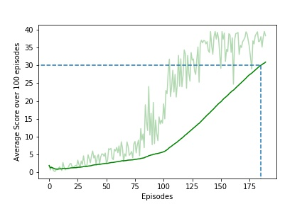

# DDPG_Continuous_Control

## Actor-Critic Policy Gradient Network agent for controlling the Robotic Hand movement in UnityML agent.

A  simple project to show how to implement an actor-critic policy gradient network agetn using Python, PyTorch, and a ML-Agents environment. This project has been done as a part of Udacity Nanodegree in Deep Reinforcement Learning (DRL).

## Project Structure:
```
├───.ipynb_checkpoints
├───.ipynb_checkpoints
├───images
├───plots
├───python
│   ├───communicator_objects
│   ├───curricula
│   ├───tests
│   ├───unityagents
│   └───unitytrainers
│       ├───bc
│       └───ppo
│ ddpg_agent.py
│ model.py
│ Continuous_Control.ipynb
│ README.md
│ memory.py
│ Report.pdf
│ test_agent.py
│ train_agent.py
│ unity-environment.log
├───saved_models
├───scores
└───__pycache__
```

Important files and folders :
- 
- `model.py:` Contains the source code for Actor-Critic Network.
- `ddpg_agent.py:` Contains the source code for DDPG Agent, utilized Actor-Critic network defined in model.py module.
- `memory.py:` Contains the source code for Replay Buffer.
- `utils.py:` Contains the source code for generating Plots, CPU/GPU Device.
- `train_agent.py:` Source code for training agent.
- `test_agent.py:` Source code for testing agent.
- `ou_noise.py:` Source code for Ornstein-Uhlenbeck Noise.
- `Continuous_Control.ipynb:` Jupyter Notebook (for the project, trained on GPU)
- `saved_models:` Folder that contains the weigts of trained DQN (.pth format)
- `scores:` Folder that contains the scores/rewards earned by the DQN agent (.csv format)
- `python:` The files in this directory are the ML-agents toolkit files and the dependencies thare are required to run the Banana Environment.

Code has been extracted from the code examples provided by Udacity Deep Reinforcement Learning Team, 2021.

The repository also includes Mac/Linux/Windows version of a sample Unity environment, Banana for testing. The Unity application and testing environment was developed using ML-agents Beta v0.4. The version of the Banana environemnt employed for this project was developed for the Udacity Deep Reinforcement Learning Nanodegree course. For more information please refer to the following link:  [Udacity Deep Reinforcement Learning](https://www.udacity.com/courses/deep-reinforcement-learning-nanodegree--nd893)

 For more information about the Unity ML Agents Toolkit visit:  [Unity ML Toolkit](https://github.com/Unity-Technologies/ml-agents)


## Unity Environment - Reacher 

The example uses a modified version of the Unity ML-Agents Reacher example Environment. The environment includes a double-jointed arm that can move to target locations. The goal of the agent is to maintain its position at the target location for as many time steps as possible. For the version of Reacher environment being used in this porject, it is considered that the agent has solved the environment when the average score over the last 100 episodes >= +30.0.


State Space
-
The agent is trained from vector input data (not the raw pixels as input data). The state space consists of 33 variables corresping to position, rotation, velocity and angular velocities of the arm.


 Action Space
 -
Since we are training an agent to take actions that can have continuous values, the action here is a vector of 4 number, corresponding to torque applicable to two joints. And, every entry in the action vector (consisting 4 entries) should be a number between -1 and 1.


Reward:
-
A reward of +0.1 is provided for each step that the agent's hand is in the goal location.

## Training Environment - Versions

For this project, two separate versions of the Unity environemnt are provided:

 - The first verstion contains a single agent. 
 - The second version contains 20 identical agents, each with its own copy of the environment.
	 - The second version is useful for algorithms like, PPO, A3C, D4PG that use multiple (non-interacting, parallel) copies of the same agent to distribute the task of gathering experience.


## Solving the environemnt

### Option 1: Solve the environment with single agent. (This Repository)

 - The task is episodic, and in order to solve the environment, the agent must get an average score of +30 over 100 consecutive episodes.

### Option 2: Solve the environment with 20 identical agents. (Future Work, yet to be implemented)

The barrier for solving the second verion of the environment is slightly different, to take into account the presence of many agents. In particular, the agents must get an average score of +30 over 100 consecutive episodes, and over all agents). Specifically,

After each episode, we add up the rewards that each agent received(withoug discounting), to get a score for each agent. This yeilds 20 (potentially different) scores. We then take the average of those 20 scores.

This yields an average score for each episode (where the average is over all 20 agents).


Installation and getting started with:

## Set up the Environment (adapted from Udacity DRL [GitHub Repo](https://github.com/udacity/deep-reinforcement-learning) )

To set up your python environment to run the code in this repository, follow the instructions below.

1. Create (and activate) a new environment with Python 3.6.

    - __Linux__ or __Mac__: 
    ```bash
    conda create --name drlnd python=3.6
    source activate drlnd
    ```
    - __Windows__: 
    ```bash
    conda create --name drlnd python=3.6 
    activate drlnd
    ```
    
2. Follow the instructions in [this repository](https://github.com/openai/gym) to perform a minimal install of OpenAI gym.  
    - Next, install the **classic control** environment group by following the instructions [here](https://github.com/openai/gym#classic-control).
    - Then, install the **box2d** environment group by following the instructions [here](https://github.com/openai/gym#box2d).
    
3. Clone the repository (if you haven't already!), and navigate to the `python/` folder.  Then, install several dependencies.
```bash
git clone https://github.com/Rohithmarktricks/DDPG_Continuous_Control.git
cd DDPG_Continuous_Control/python
(drlnd) C:/../DDPG_Continuous_Control/python >pip install .
```
 - For __Windows 10__: This project has been developed with python v3.6 and PyTorch v0.4.0. You might see the `pytorch==0.4.0`. Incase, if you have faced any issues related to PyTorch related to pytorch installation. Follow the below steps, before proceeding to step 5
 - remove `pytorch==0.4.0` from python/requirements.txt and from command prompt,
 ```bash
(drlnd) C:/../DDPG_Continuous_Control >conda install pytorch=0.4.0 -c pytorch
(drlnd) C:/../DDPG_Continuous_Control > cd python
(drlnd) C:/../DDPG_Continuous_Control/python > pip install .
```


4. Create an [IPython kernel](http://ipython.readthedocs.io/en/stable/install/kernel_install.html) for the `drlnd` environment.  
```bash
(drlnd) C:/../DDPG_Continuous_Control >python -m ipykernel install --user --name drlnd --display-name "drlnd"
```

5. Before running code in a notebook, change the kernel to match the `drlnd` environment by using the drop-down `Kernel` menu. 


## Download the Unity Environment:
For this project, you don't need to install Unity. For the sake of easiness, a standalone application of the Reacher's Unity Environment has already been built and can be used.

Download the relevant environment zip file from one of the links below based on the operating system that you ar using.

### Version 1: Single Agent
-   Linux:  [click here](https://s3-us-west-1.amazonaws.com/udacity-drlnd/P2/Reacher/one_agent/Reacher_Linux.zip)
-   Mac OSX:  [click here](https://s3-us-west-1.amazonaws.com/udacity-drlnd/P2/Reacher/one_agent/Reacher.app.zip)
-   Windows (32-bit):  [click here](https://s3-us-west-1.amazonaws.com/udacity-drlnd/P2/Reacher/one_agent/Reacher_Windows_x86.zip)
-   Windows (64-bit):  [click here](https://s3-us-west-1.amazonaws.com/udacity-drlnd/P2/Reacher/one_agent/Reacher_Windows_x86_64.zip)

### Version 2: Multiple(20) Agents
-   Linux:  [click here](https://s3-us-west-1.amazonaws.com/udacity-drlnd/P2/Reacher/Reacher_Linux.zip)
-   Mac OSX:  [click here](https://s3-us-west-1.amazonaws.com/udacity-drlnd/P2/Reacher/Reacher.app.zip)
-   Windows (32-bit):  [click here](https://s3-us-west-1.amazonaws.com/udacity-drlnd/P2/Reacher/Reacher_Windows_x86.zip)
-   Windows (64-bit):  [click here](https://s3-us-west-1.amazonaws.com/udacity-drlnd/P2/Reacher/Reacher_Windows_x86_64.zip)

After you have downloaded the relevant zip file, navigate to where you downloaded and saved this GitHub repository and place the file in the main folder of the repository, then unzip (or decompress) the file.


## Training 
6. In the `DDPG_Continuous_Control` folder, you may chose one of the below methods to run train the agent.
- You may chose to open `Continuous_Control.ipynb` jupyter notebook to experiment with the environment and tune agent performance.
- Else, you can try running the below commands in the terminal to train/test agent in the Banana Environment:
```bash
conda activate drlnd
cd DDPG_Continuous_Control
DDPG_Continuous_Control >python train_agent.py <Location/Path to Reacher/Reacher.exe>
```


## Testing
7. To test the trained agent, you may use the following command:
```bash
conda activate drlnd
cd DDPG_Continuous_Control
DDPG_Continuous_Control >python test_agent.py <Location/path to Reacher/Reacher.exe> <path to saved models weights .pth file>
```

## Training Performance
The agent has been trained over 10 times, and on average the agent has taken around 170+ episodes to solve the Unity ML Reacher Environment i.e., to score the atleast +30.0 average reward over 100 episodes. However, the least number of episodes required to solve the environment was 175 episodes).



## Sample Testing (Jupyter Notebook)
To test the Unity ML environment and the agent, Jupyter Notebook `Continuous_Control.ipynb` has been provided. You can quickly change the code/ tweak few hyperparameters to get started.

## Future Work:
- To train agent using A3C and D4PG.
- D4PG tries to improve the accuracy of DDPG with the help of distributional approach. A softmax function is used to prioritize the experiences and provide them to the actor.

## References:
1. https://julien-vitay.net/deeprl/DPG.html
2. [CONTINUOUS CONTROL WITH DEEP REINFORCEMENT LEARNING](https://arxiv.org/pdf/1509.02971.pdf)
3. Ravichandiran, Sudharsan. Deep Reinforcement Learning with Python: Master classic RL, deep RL, distributional RL, inverse RL, and more with OpenAI Gym and TensorFlow, 2nd Edition. Packt Publishing.
